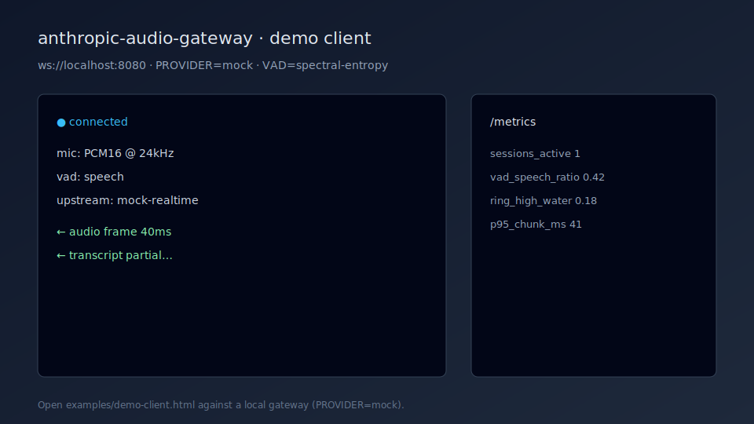
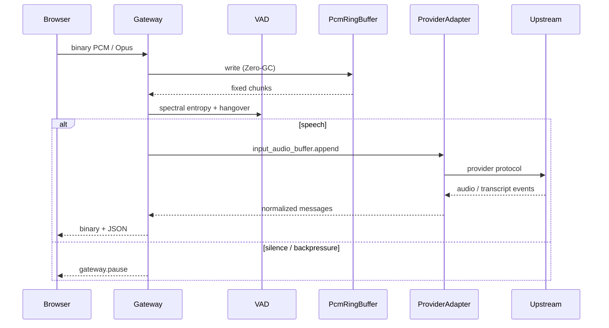

# Anthropic Live-Audio Stream Gateway

AGPL-3.0 real-time AI audio runtime: browser (or WebRTC-bridged) PCM/Opus → provider adapters (Anthropic, OpenAI, Gemini, Deepgram, Mock) with Zero-GC ring buffers, spectral-entropy VAD, Transform backpressure, Prometheus metrics, plugins, and adaptive streaming.

**Version:** 0.2.0 · **License:** [AGPL-3.0-only](LICENSE)

> Anthropic’s public Messages API is HTTP/SSE today. Realtime-style WSS URLs are configurable per provider. Use `PROVIDER=mock` for local/CI work without cloud credentials.

> **Security — open relay:** If `AUTH_JWT_SECRET` is unset, **any client that can reach the WebSocket can drive your configured provider with your server-side API key**. Treat unbound deployments as an open relay. Set `AUTH_JWT_SECRET` (and preferably `AUTH_ALLOWED_ORIGINS`) before exposing the port beyond localhost. For production, set `AUTH_REQUIRED=true` so the process refuses to boot without a secret.

## Demo



Open [`examples/demo-client.html`](examples/demo-client.html) against a local gateway with `PROVIDER=mock`. Details: [docs/demo/README.md](docs/demo/README.md).

## Architecture



| Layer | Module |
| --- | --- |
| Ingress | [`src/index.ts`](src/index.ts), [`src/webrtc/ingress.ts`](src/webrtc/ingress.ts), [`src/auth.ts`](src/auth.ts) |
| Session | [`src/gateway.ts`](src/gateway.ts), [`src/session/stats.ts`](src/session/stats.ts), [`src/session/manager.ts`](src/session/manager.ts) |
| Audio | [`src/audio-processor.ts`](src/audio-processor.ts) (Int16Array ring) |
| VAD | [`src/vad/`](src/vad/), [`src/vad-util.ts`](src/vad-util.ts) |
| Providers | [`src/providers/`](src/providers/) |
| Plugins / adaptive | [`src/plugins/registry.ts`](src/plugins/registry.ts), [`src/adaptive/controller.ts`](src/adaptive/controller.ts) |
| Metrics | [`src/metrics/prometheus.ts`](src/metrics/prometheus.ts) → `GET /metrics` |

## Quick start

```bash
cp .env.example .env
# PROVIDER=mock for local; or anthropic + sk-ant-... key

npm install
npm run dev
```

```bash
curl -s http://127.0.0.1:8080/health
curl -s http://127.0.0.1:8080/metrics | head
```

Open [`examples/demo-client.html`](examples/demo-client.html) against `ws://127.0.0.1:8080`. Live-provider checklist: [`docs/SMOKE_REAL_PROVIDER.md`](docs/SMOKE_REAL_PROVIDER.md).

```bash
npm test                 # unit + mock WS integration (also run in CI)
npm run bench            # local mock load harness
npm run typecheck && npm run check && npm run build
```

CI runs **check + typecheck + test + build** on Node 20/22 (bench is local-only).

## Providers

| `PROVIDER` | Adapter | Auth env |
| --- | --- | --- |
| `anthropic` | Realtime-style WSS | `ANTHROPIC_API_KEY` (`sk-ant-…`) |
| `openai` | OpenAI Realtime | `OPENAI_API_KEY` |
| `gemini` | Gemini Live WSS | `GEMINI_API_KEY` |
| `deepgram` | Live listen WSS | `DEEPGRAM_API_KEY` |
| `mock` | In-process echo | none |

## Latency path

```
mic → WS frame → ring write → VAD → Transform queue → provider send → upstream
                                                                    ↓
browser ← JSON/binary relay ← provider onMessage ←─────────────────┘
```

Tune `CHUNK_DURATION_MS`, `HIGH_WATER_MARK`, and enable `ADAPTIVE_STREAMING=true` to adjust chunk/HWM/hangover from live RTT and queue depth.

## Backpressure

When provider `bufferedAmount` or the outbound Transform exceeds `HIGH_WATER_MARK`, the gateway emits `gateway.pause`, pauses the client socket, and resumes with `gateway.resume` on drain.

## Observability

- `GET /health` — sessions, silence ratio, VAD triggers
- `GET /metrics` — Prometheus (see [`grafana/audio-gateway-dashboard.json`](grafana/audio-gateway-dashboard.json))
- Session stats: RTT, silence ratio, speaking rate, queue depth, reconnects, rate limits

## Auth (v1)

Optional HS256 JWT (`AUTH_JWT_SECRET`) via `?token=` or `Authorization: Bearer`. Optional `AUTH_ALLOWED_ORIGINS`, per-subject rate limit and session quotas.

**Unset `AUTH_JWT_SECRET` = open relay** to your provider API key for anyone who can open a WebSocket. The process prints an OPEN RELAY WARNING on boot. Set `AUTH_REQUIRED=true` in production so boot fails closed without a secret.

## Contributing

See [CONTRIBUTING.md](CONTRIBUTING.md). PRs should pass `npm run check && npm run typecheck && npm test && npm run build`.

## WebRTC ingress

`WEBRTC_INGRESS=true` exposes `/webrtc` (offer → synthetic answer → PCM frames on the same socket). Prefer terminating DTLS/SRTP at a media edge and forwarding PCM here — see `GET /webrtc/info`.

## Plugins

Register codecs / VAD / preprocess / analytics / exporters via [`src/plugins/registry.ts`](src/plugins/registry.ts). Built-ins: noise-suppress stub, silence analytics.

## Benchmarks

See [`bench/report.md`](bench/report.md). `npm run bench` prints JSON (p50/p95 latency, throughput, RSS/session).

## Kubernetes probes

```yaml
livenessProbe:
  httpGet: { path: /health, port: 8080 }
readinessProbe:
  httpGet: { path: /health, port: 8080 }
```

Scrape `/metrics` from Prometheus. Scale horizontally with sticky sessions if you add shared session stores later; each replica is memory-bounded by `RING_BUFFER_SECONDS` × sessions × `HIGH_WATER_MARK`.

## Environment

See [`.env.example`](.env.example). Boot fails before port bind if the active provider’s credentials are invalid (Anthropic keys must start with `sk-ant-`).

## AGPL-3.0

If you modify this and offer it as a network service, you must provide corresponding source to users under AGPL-3.0. See [LICENSE](LICENSE). That is a deliberate copyleft choice for this suite — not an unexamined default.

## Related projects

| Project | Role |
|---|---|
| [codex-ast-mapper](https://github.com/dranshrad/codex-ast-mapper) | Compress repositories into token-budgeted LLM context |
| [llm-cst-refactorer](https://github.com/dranshrad/llm-cst-refactorer) | Format-preserving typing & docstring refactors |
| [automated-self-correction-loop](https://github.com/dranshrad/automated-self-correction-loop) (ASCL) | Execute → diagnose → heal loop |
| [voice-notes-to-anthropic-artifacts](https://github.com/dranshrad/voice-notes-to-anthropic-artifacts) | Local STT → Anthropic → `~/Artifacts` |
| [anthropic-audio-gateway](https://github.com/dranshrad/anthropic-audio-gateway) | Browser audio ↔ realtime provider adapters |

## Disclaimer

Not affiliated with Anthropic, OpenAI, Google, or Deepgram. Verify provider protocols against current vendor docs before production.
