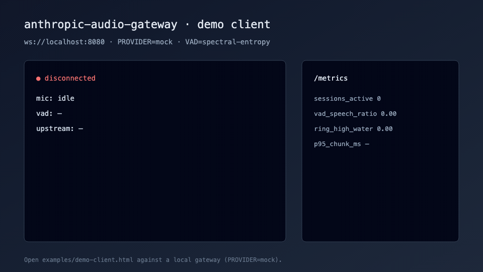

# Demo client visual



Live UI: open [`examples/demo-client.html`](../../examples/demo-client.html) against a local gateway with `PROVIDER=mock`.

Static storyboard (single frame): [demo-client.svg](demo-client.svg).

## Regenerate GIF

The checked-in GIF is a short UI storyboard (disconnected → connecting → connected → speech → tone/metrics).

```bash
# optional: capture live frames from the real demo client, or rebuild storyboard HTML frames
# then:
ffmpeg -y -framerate 1.4 -i docs/demo/_frames/%02d.png \
  -vf "scale=960:540:flags=lanczos,split[s0][s1];[s0]palettegen=max_colors=128[p];[s1][p]paletteuse" \
  -loop 0 docs/demo/demo-client.gif
```
